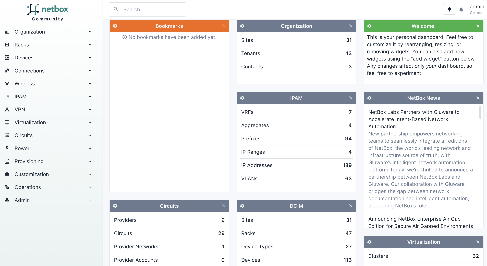

# Module 1 - Introduction 

Hello and welcome to the first module in this NetBox 'Zero-to-Hero' course. By the end of this module you will be able to:  

- Describe what NetBox is and it's main features and benefits
- Navigate around the Web Interface and explore the data model
- Explore the REST API and start to use it to programmatically interact with NetBox 

## What is NetBox?
NetBox is designed to be an **Authoritative Network Source of Truth**, providing a complete strategic picture across multiple aspects of network management. That strategic layer then acts as the backbone for layers of network automation and monitoring tools.

It’s worth noting that NetBox is designed to show the *desired* state of a network, not its operational state. As a source of truth for that desired state, NetBox is what network monitoring and assurance tools use as the basis of comparison to current reality. 

NetBox is thriving as an open source tool, with over 13,000 [GitHub](https://github.com/netbox-community/netbox) stars, 2,300 forks, and a vibrant [user community](https://github.com/netbox-community/netbox/discussions). NetBox is currently deployed on thousands of networks around the world, representing a diverse mix of use cases, market verticals, and places along the automation journey. The user base spans some of the world’s largest and most complex telecommunications networks to smaller networks of 
just a few devices.

From the [Official NetBox Documentation](https://docs.netbox.dev/en/stable/): 
> ### The Premiere Network Source of Truth
>
>NetBox is the leading solution for modeling and documenting modern networks. By combining the traditional disciplines of IP address management (IPAM) and datacenter infrastructure management (DCIM) with powerful APIs and extensions, NetBox provides the ideal "source of truth" to power network automation. 

>### Built for Networks
>
>Unlike general-purpose CMDBs, NetBox has curated a data model which caters specifically to the needs of network engineers and operators. It delivers a wide assortment of object types carefully crafted to best serve the needs of infrastructure design and documentation. These cover all facets of network technology, from IP address managements to cabling to overlays and more.

>### Customizable & Extensible
>
>In addition to its expansive and robust data model, NetBox offers myriad mechanisms through which it can be customized and extended. Its powerful plugins architecture enables users to extend the application to meet their needs with minimal development effort.

>### Always Open
>
>Because NetBox is an open source application licensed under Apache 2, its entire code base is completely accessible to the end user, and there's never a risk of vendor lock-in. Additionally, NetBox development is an entirely public, community-driven process to which everyone can provide input.

### Comprehensive Data Center Infrastructure Management (DCIM)
NetBox documents every physical infrastructure component, providing a complete picture of assets and how they connect to one another. This map of the ideal network state forms the baseline for a wide range of automated tasks like configuration checks, monitoring, and much more.

Supported NetBox DCIM components include:

- Sites
- Racks
- Hardware (rack-mounted devices)
- Cabling
- Modules (device-installable components)
- Circuits
- Wireless LANs, groups, and links
- Power panels and feeds

### IP Address Management (IPAM)
Just as it maps the physical components of a network, NetBox also documents IP addresses and ranges to reflect the ideal state of device connections across your infrastructure. Using NetBox as a source of truth for IP address management, standard network automation platforms like Ansible and Terraform deploy configurations against that plan.

NetBox tracks and manages a wide variety of IPAM components, including:

- Regional internet registries (RIRs)
- Prefixes
- Prefix/VLAN roles
- IP ranges
- IPv4 and IPv6 addresses
- Network Address Translations (NATs)
- Virtual Local Area Networks (VLANs)
- Virtual Routing and Forwarding (VRF) objects
- Route targets
- First-hop redundancy protocol (FHRP) groups and assignments
- Autonomous System Numbers (ASNs)
- TCP and UDP services

## Video  1 - Introduction to the NetBox Web Interface
The best way to understand the power of NetBox is to dive right in and start exploring, and this short video will give you a guided tour of the Web Interface: 

## Video 2 - Introduction to the NetBox REST API
For a deep dive, you can check out the NetBox [REST API documentation](https://docs.netbox.dev/en/stable/integrations/rest-api/). 
For now, let's take a quick tour of the REST API in this short video, which will help you to get up and running in no time: 

## Summary
In this module you have learned what NetBox is along with it's main features and benefits. You also learned how to navigate around the Web Interface and explored the REST API, and how to use it to programmatically interact with NetBox.

In [Module 2: Setting up the Organization](../2-setting-up-the-organization/2-setting-up-the-organization.md) you will learn how to model an organization within NetBox, and how to use the Web Interface to both manually create individual objects, and bulk import objects using CSV-formatted data. 

## Join the Discussion
If you have any questions as you go through the course then pop on over to the [NetBox Zero to Hero channel](https://netdev-community.slack.com/archives/C0453L6565C) on the NetDev Community Slack! If you aren't already a member then you can sign up for free [here](https://netdev.chat/).

## Useful Links
- [Official NetBox Documentation](https://docs.netbox.dev/en/stable/)
- [NetBox GitHub](https://github.com/netbox-community/netbox)
- [GitHub Discussions](https://github.com/netbox-community/netbox/discussions)
- [NetBox Community Device Type Library](https://github.com/netbox-community/devicetype-library)
- [NetBox Cloud](https://netboxlabs.com/pricing//) is a hosted solution offered by NetBox Labs
