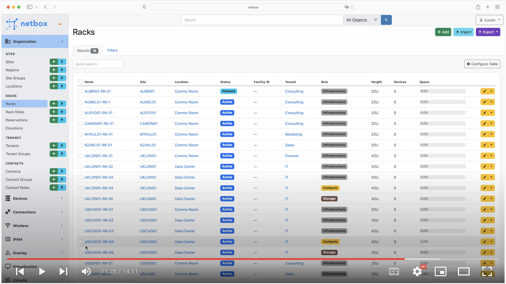

# Introduction

Hello and welcome to module 3 of the NetBox 'Zero-to-Hero' course. In [Module 2: Setting up the Organization](../2-setting-up-the-organization/2-setting-up-the-organization.md) you learned how to model an organization within NetBox, and how to use the Web Interface to both manually create individual objects, and bulk import objects using CSV-formatted data. 

In this module we will continue to populate NetBox with data for our fictional organization. Our intrepid Network Engineer Eric will be adding the network devices that are going to be installed at the planned new Brisbane branch office, making use of the NetBox REST API (he's heard about these API things on a podcast and is keen to learn how to work with one!).

By the end of this module you will be able to:  
- Describe how NetBox models devices
- Use Postman to make REST API calls to NetBox
- Save time by making use of the community library of pre-defined device types

## Get Hands On
If you'd like to follow along with the examples used in this course, it's super easy to do, and you have a few options: 
1.  Run NetBox as a container with [NetBox Docker](https://github.com/netbox-community/netbox-docker) - This is the quickest way to get your own dedicated NetBox instance going and it only takes a few minutes to spin up on your laptop!
2.  Follow the [official documentation](https://docs.netbox.dev/en/stable/installation/) and do a full installation all the NetBox components. These instructions have been tested on Ubuntu and CentOS Linux.
3.  Use the public [demo instance](https://demo.netbox.dev/) of NetBox   

The NetBox version used in the video for this module is v3.3.2, and the following course materials used in the demo are available: 
- [Postman collection]() for making API calls
- [YAML files](../3-adding-the-kit/yaml_data/) used for device types

## Devices
Devices are a key part of NetBox - after all NetBox is a tool for modeling network infrastructure. A device can be any piece of physical hardware installed within your network, such as server, router, or switch, and may optionally be mounted within a rack. Within each device, resources such as network interfaces and console ports are modeled as discrete components, which may optionally be grouped into modules.

Device objects in NetBox have some dependencies that must already exist in NetBox before you can add the device. They are Manufacturer (the organization that produces the hardware) and Device Type. A device can be installed at a particular position within an equipment rack, or simply associated with a site (and optionally with a location within that site).

## Device Types
A device type is a combination of manufacturer and hardware model that maps to actual devices that exist in the real world. Device types typically have a number of components modelled on them too for things like interfaces, console ports, and power ports etc. 

An example of a device type is a Cisco ISR4321 Router (part_number: ISR4321/K9), and this might have the following component templates defined:

- 3 x GigabitEthernet interfaces
- 1 x Console Port
- 1 x Power Port

Once a device type has been created, then each new device instance of that particular device type you add will have all of the components defined in the device type. 

## Device Roles
These are the functional roles of devices, and are fully customizable by the user. For example, you might create roles for core switches, distribution switches, and access switches within your network.

## Platforms
A platform defines the type of software running on a device or virtual machine, for example Cisco IOS version 15. NetBox can optionally connect to network devices (to retrieve device information such as LLDP Neighbors) using [NAPALM](https://napalm.readthedocs.io/en/latest/) and you also define the driver to be used (eg. ios) as part of the Platform definition.

## The Project - New Branch Site Devices
Our fictional organization has standardized on the following network devices for their Branch office network deployments:

| Manufacturer | Device Type | Device Role | Platform | Napalm Driver |
| --- | --- | --- | --- | --- |
| Cisco | ISR4321 | WAN Router | Cisco IOS 15 | ios |
| Juniper | EX4300-48P | Access Switch | Junos 22.1 | junos |
| Cisco Meraki | MR56 | Wireless AP | n/a | n/a |
| Avocent | ACS16 | Console Server | n/a | n/a |
| Panduit | Mini-Com High Density Patch Panel (48 Port, 1RU) | Patch Panel | n/a | n/a |

## Video - Adding Devices Into NetBox
As always the best way to understand the power of NetBox is to dive right in! This video will step through creating all the devices for our fictional organization's new branch office network in Brisbane, Australia.`

With that said, let's get started. If you are following along, don't forget to use the [Postman collection]() for making the API calls and the [YAML files](../3-adding-the-kit/yaml_data/)` used for adding device types.

 

OK, so now you know how to add your devices into NetBox, in the next module you will learn how to....TBC

## Useful Links
- [Official NetBox Documentation](https://docs.netbox.dev/en/stable/)
- [NetBox REST API Overview](https://docs.netbox.dev/en/stable/integrations/rest-api/)
- [NetBox Docker](https://github.com/netbox-community/netbox-docker)
- [NetBox Community Device Type Library](https://github.com/netbox-community/devicetype-library)