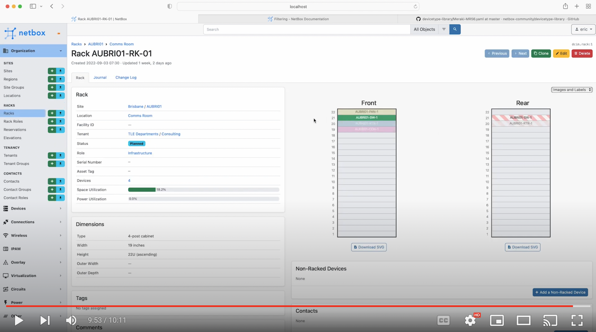

# Introduction

Hello and welcome to module 4 of the NetBox 'Zero-to-Hero' course. In [Module 3: Adding the Kit](../3-adding-the-kit/3-adding-the-kit.md),  Eric (our awesome Network Engineer) added the devices that are going to be installed at the planned new Brisbane branch office, making use of a Postman collection of REST API calls to NetBox.

In this module Susan (the other member of the Network Engineering dream team) will populate NetBox with the IP addressing and VLAN data for the new Brisbane branch office. To do this Susan is using the [Ansible Automation Platform](https://www.ansible.com/) and in particular the collection of [NetBox Ansible modules](https://docs.ansible.com/ansible/latest/collections/netbox/netbox/index.html)

By the end of this module you will be able to:
- Describe how NetBox models IPAM (IP Address Management) Data
- Integrate NetBox with Ansible and run playbooks to populate the NetBox database
- Get started with a set of [Ansible playbooks](../../ansible/) for NetBox that can be easily adapted and extended to suit your own requirements 

## Why Integrate NetBox with Ansible? 
From the [Ansible](https://www.ansible.com/use-cases/network-automation) website: 
>
>Ansible Automation Platform is a single, flexible automation technology that can be used across diverse network devices and other IT domains, making it easy to automate entire network and IT processes.

Of course, you could add IPAM data manually via the Web Interface, but when you are dealing with a lot of data that can quickly become tedious and is error prone. Integrating NetBox with Ansible is quick and easy, and within a few minutes you can be running Ansible playbooks to Create, Read, Update and Delete (CRUD operations in computer programming terms) NetBox data programmatically via the REST API.

Also, as any Network Engineer / IT Pro looking to expand their skill set knows, Automation is becoming critical for managing modern networks, so by adding some Ansible knowledge to your armory, you will stay ahead of the game!

## Get Hands On
If you'd like to follow along with the examples used in this course, it's super easy to do, and you have a few options: 
1.  Run NetBox as a container with [NetBox Docker](https://github.com/netbox-community/netbox-docker) - This is the quickest way to get your own dedicated NetBox instance going and it only takes a few minutes to spin up on your laptop!
2.  Follow the [official documentation](https://docs.netbox.dev/en/stable/installation/) and do a full installation all the NetBox components. These instructions have been tested on Ubuntu and CentOS Linux.
3.  Use the public [demo instance](https://demo.netbox.dev/) of NetBox   

The software versions used in the video for this module are: 
- `NetBox v3.3.2`
- `Python 3.8.9`
- `ansible-core 2.13.4`
- `ansible package 6.4.0`
- `pynetbox 6.6.2`

## Installing Ansible
Ansible runs on Linux based systems, and is installed as a Python package. Follow these [steps](../../ansible/readme.md) to set up Ansible on your own system - it takes less than 5 minutes!

## Using NetBox For IPAM
From the NetBox documentation: 

>### IP Address Management
>IP address management (IPAM) is one of NetBox's core features. It supports full parity for IP4 and IPv6, advanced VRF assignment, automatic hierarchy formation, and much more.

IPAM data is hierarchical in nature and NetBox reflects this: 

## RIRs and Aggregates
Regional Internet Registries (**IRRs**), such as ARIN, RIPE, APNIC control the allocation of globally-routable address space. Internal IP address space (eg. RFC 1918) is also treated as an RIR within NetBox, and users can can create whatever RIRs they like. 

Aggregates are assigned to RIRs, and typically, an aggregate will correspond to either an allocation of public (globally routable) IP space granted by a regional authority, or a private (internally-routable) designation.

Our fictional organization will be using RFC 1918 Private Address space for IPv4, which has the following Aggregates assigned to it: 

-  10.0.0.0/8
-  172.16.0.0/12
-  192.168.0.0/16

## Prefixes and IP Ranges
IP subnets are defined within an aggregate. **Prefixes** extend the hierarchy by nesting within one another. (For example, 192.168.123.0/24 will appear within 192.168.0.0/16.) Each prefix can be assigned a functional role as well as an operational status.

**IP Range** - these are are arbitrary ranges of individual IP addresses within a prefix, all sharing the same mask. Ranges are commonly affiliated with DHCP scopes, but can be used for any similar purpose.

Our fictional organization will be using a 'SuperNet' Prefix of **192.168.0.0/22** for the planned new office site in Brisbane, and this will be further divided into smaller, individual prefixes. When populating NetBox with this data the Ansible playbook will request the next available prefix based on prefix length requirements. 

## IP Addresses
These are individual IP addresses along with their subnet mask, that are automatically arranged beneath their parent prefixes. 

## Prefix and VLAN Roles
Roles define the function of a prefix or VLAN - for example you might define separate Voice and WiFi roles for your prefixes and VLANs. The following roles will be used by our fictional organization: 

- Branch_Data
- Branch_Voice
- Branch_WiFi
- Guest_WiFi
- Network_Management
- Point_to_Point

## VLAN Groups
VLAN groups can be used to organize your VLANs in a way that suits your organization, and their scope can be a particular region, site group, site, location, rack, cluster group, or cluster. 

Our fictional organization will be using a VLAN group called **Brisbane_VLANS** which will be scoped to the site level. This means that any VLAN assigned from this group will be tied to devices and VM's within the scoped site. 

## The Project - New Branch Site IPAM Data
Our fictional organization will be using the following IPAM data for the new site in Brisbane: 

### Brisbane Prefixes and VLANs
All prefixes assigned will be the next available, and allocated dynamically in NetBox from the **192.168.0.0/22** Supernet using an Ansible playbook.

| VLAN Name | VLAN ID | VLAN Group | Role | Prefix Length |
| :--- | :---: | :--- | :--- | :---: |
| DATA | 10 | Brisbane_VLANS | Branch_Data | /25 | 
| VOICE | 20 | Brisbane_VLANS | Branch_Voice | /25 | 
| B_WIFI | 30 | Brisbane_VLANS | Branch_WiFi | /25 | 
| G_WIFI | 40 | Brisbane_VLANS | Guest_WiFi | /25 | 
| NETMAN | 50 | Brisbane_VLANS | Network_Management | /26 | 
| P2P | 60 | Brisbane_VLANS | Point_to_Point | /30 | 

### Brisbane IPv4 Addresses
All IP addresses assigned will be the next available, and allocated dynamically from the corresponding Prefix using an Ansible playbook. The list of devices and interfaces to be assigned IP addresses is as follows: 

| Device | Interface | VLAN ID |
| --- | --- | --- | 
| AUBRI01-RTR-1 | GigabitEthernet0 | 50 |
| AUBRI01-RTR-1 | GigabitEthernet0/0/0 | 60 |
| AUBRI01-SW-1|  me0 | 50 |
| AUBRI01-SW-1 | ge-0/0/0 | 60 |
| AUBRI01-SW-1 | vlan.10 | 10 |
| AUBRI01-SW-1 | vlan.20 | 20 |
| AUBRI01-SW-1 | vlan.30 | 30 |
| AUBRI01-SW-1 | vlan.40 | 40 |
| AUBRI01-SW-1 | vlan.50 | 50 |
| AUBRI01-SW-1 | vlan.60 | 60 |
| AUBRI01-AP-1 |  main | 50 |
| AUBRI01-AP-2 |  main | 50|
| AUBRI01-CON-1 | Ethernet | 50 |

## Video - Adding IPAM Data Into NetBox
OK, so that's the planning and design work done - now onto the demo! This video will step you through how to populate NetBox with the IPAM data using Ansible. As always the best way to understand the power of NetBox is to dive right in, so let's get started!

 

OK, so now you know how to ...... in the next module you will learn how to....

## Useful Links
- [Official NetBox Documentation](https://docs.netbox.dev/en/stable/)
- [NetBox REST API Overview](https://docs.netbox.dev/en/stable/integrations/rest-api/)
- [Zero to Hero Postman collection](../../postman/NetBox-Zero-to-Hero.postman_collection.json) 
- [NetBox Community Device Type Library](https://github.com/netbox-community/devicetype-library)
- [NetBox Docker](https://github.com/netbox-community/netbox-docker)